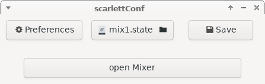
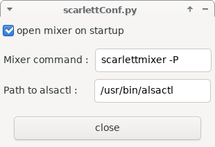

# ScarlettConf

This is a little python gui I wrote to manage different settings for my *scarlett 18i20* under linux.
ScarlettConf is only for loading and saving settings. To adjust the settings use [scarlettmixer](https://github.com/x42/scarlett-mixer).

To run scarlettConf install `python3` and `PyGObject` and do :

    cp scarlettConf.py $HOME/.local/bin/scarlettConf
    chmod a+x $HOME/.local/bin/scarlettConf

## screenshots

